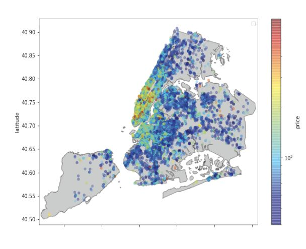

# Airbnb Price Prediction

## Description

Created by Colin Laganier, Alexandre Berkovic, Megan Hale and Louis Horrell as part of DE2 Big Data Module.

A model to predict the nightly price of an Airbnb listing in New York City was made using a dataset of Airbnb listings, of Zillow real estate values and Google Places venues of interest. The premise of the model is to recommend a suitable nightly price for a newly listed property on the platform. 

This project was created coraboratively using Google Colab. 

## Libraries

-Pandas v1.1.5

-NumPy v1.19.5

-Matplotlib v3.2.2

-SciPy v1.4.1

-Scikit-learn v0.22.2

-Seaborn v0.11.1

## Datasets

The *listings*, *venues* and *real_estate* datasets can be downloaded from the Imperial AI Hack 2020 *airbnb_challenge* release: https://github.com/aihack20/airbnb_challenge/releases/tag/data

The datasets naming schemes were not changed, but for clarity:

-listing.csv

-real_estate.csv

-venues.csv

